<h1 align="center">Hi 👋, I'm Benjamin Roget</h1>
<h3 align="center">A passionate IT student from France</h3>

  

  

- 🔭 I’m currently working on [my NixOS config](https://github.com/Strange500/nixos-config) & [My portfolio](https://github.com/Strange500/nextPortfolio)

- 🌱 I’m currently learning **Rust and Angular**

- 👨‍💻 All of my projects are available at [https://portfolio.qgroget.com](https://portfolio.qgroget.com)

- 📫 How to reach me **benjamin.rogetpro@gmail.com**

<!--
&nbsp;
-->

<h3 align="left">Connect with me:</h3>

